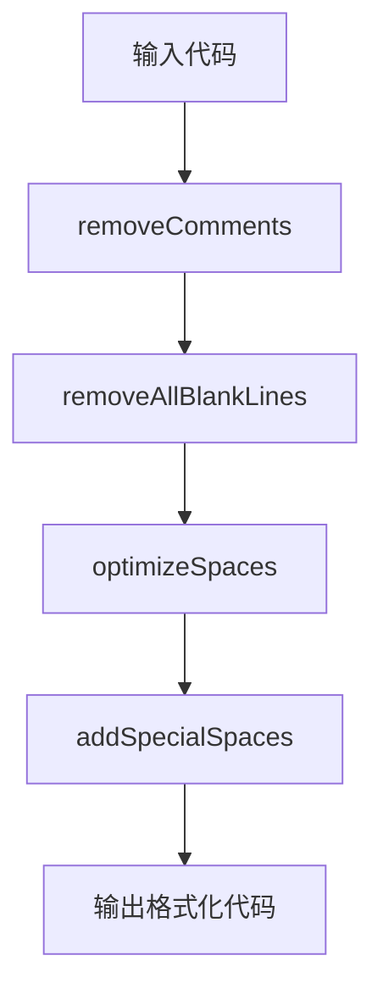

# C/C++代码格式化工具（CodeFormatter）

## 1. 功能概述

本工具是一个命令行式的 $C/C++$ 代码格式化工具，主要用于自动处理代码格式，提高代码可读性和一致性，可以使你的代码变得更紧凑。

### 1.1 核心功能

- **注释删除**：移除所有单行和多行注释
- **空格优化**：移除多余空格，仅保留必要的语法空格
- **空行处理**：移除所有空行，保持代码紧凑
- **特殊符号处理**：智能处理指针、引用和模板语法的空格

## 2. 系统架构与模块说明

### 2.1 整体架构



### 2.2 核心模块详解

| 模块名称 | 功能描述 | 输入/输出 | 关键算法 |
|---------|---------|----------|---------|
| removeComments | 移除代码中的注释 | 原始代码 → 无注释代码 | 状态机解析 |
| removeAllBlankLines | 移除空行 | 代码 → 无空行代码 | 逐行检测空行 |
| optimizeSpaces | 优化空格 | 代码 → 空格优化代码 | 空白字符处理 |
| addSpecialSpaces | 处理特殊符号空格 | 代码 → 特殊空格处理代码 | 上下文感知分析 |
| formatCode | 串联格式化流程 | 原始代码 → 格式化代码 | 流程控制 |

## 3. 功能实现详情

### 3.1 注释删除功能

**功能**：准确识别并移除C/C++代码中的所有注释，包括单行注释（// ...）和多行注释（/* ... */）

**实现**：
- 使用状态机模式处理不同的代码上下文
- 正确处理字符串和字符常量中的注释符号
- 支持跨行注释的处理

**代码示例**：
```cpp
// 输入
int main() {
    // 这是单行注释
    /* 这是
       多行
       注释 */
    return 0;
}

// 输出
int main(){
    return 0;
}
```

### 3.2 空格优化功能

**功能**：移除多余空格，仅保留必要的语法空格

**实现**：
- 移除等号、分号、逗号等操作符周围的空格
- 保持标识符之间的空格
- 正确处理自增自减运算符

**规则**：
- 等号（=）前后的空格必须移除
- 分号（;）前的空格必须移除
- 比较运算符（<、>、<=、>=、==、!=）前后的空格必须移除
- 逗号（,）前后的空格必须移除
- 自增/自减运算符（++、--）前后的空格必须移除
- 保持括号内部与内容之间无空格

**代码示例**：
```cpp
// 输入
for( int i = 0 ; i < n ; i ++ ) ;

// 输出
for(int i=0;i<n;i++);
```

### 3.3 空行处理功能

**功能**：移除代码中的所有空行，保持代码紧凑

**实现**：
- 逐行扫描代码
- 检测只包含空格/制表符的空行
- 完全移除空行，不保留换行符

**代码示例**：
```cpp
// 输入
int main() {

    int x = 5;

    return 0;
}

// 输出
int main(){
    int x=5;
    return 0;
}
```

### 3.4 特殊符号空格处理

**功能**：智能处理指针、引用和模板语法的空格

**实现**：
- **指针符*和引用符&**：在定义和声明时添加空格
- **模板符号>**：在模板结束时添加空格
- **上下文感知**：区分操作符和声明/定义的不同含义

**规则**：
- 指针/引用声明：`int* p`（添加空格）
- 乘法/位运算：`a*b`（不添加空格）
- 模板语法：`vector<int> v`（添加空格）
- 比较运算：`a>b`（不添加空格）

**代码示例**：
```cpp
// 输入
int*p;
a*b;
vector<int>v;
if(a>b)

// 输出
int* p;
a*b;
vector<int> v;
if(a>b)
```

## 4. 使用流程

### 4.1 命令行使用

**编译**：
```bash
g++ code_formatter.cpp -o code_formatter
```

**使用方式**：
1. **从标准输入读取**：
   ```bash
   ./code_formatter
   # 输入代码后按Ctrl+Z（Windows）或Ctrl+D（Linux）结束
   ```

2. **从文件读取**：
   ```bash
   ./code_formatter < input.cpp > output.cpp
   ```

### 4.2 处理流程

1. **输入代码**：通过标准输入或文件重定向提供代码
2. **处理阶段**：
   - 移除注释
   - 移除空行
   - 优化空格
   - 处理特殊符号空格
3. **输出结果**：将格式化后的代码输出到标准输出

## 5. 技术特性与实现细节

### 5.1 状态机解析

**注释处理**：使用状态机模式处理不同的代码上下文，确保正确识别注释、字符串和字符常量。

**状态定义**：
- STATE_NORMAL：正常代码
- STATE_STRING：字符串常量
- STATE_CHAR：字符常量
- STATE_LINE_COMMENT：单行注释
- STATE_BLOCK_COMMENT：多行注释

### 5.2 上下文感知算法

**特殊符号处理**：通过分析符号前后的上下文，区分不同含义：

- **指针/引用**：检查前面是否是类型关键字
- **模板语法**：使用嵌套深度计数器跟踪
- **操作符**：基于前后字符判断

### 5.3 内存管理

- **动态内存分配**：使用malloc分配内存
- **内存释放**：在处理完成后释放所有分配的内存
- **内存安全**：使用足够大的缓冲区避免溢出

## 6. 潜在问题与限制

### 6.1 未定义行为

1. **复杂宏处理**：对于包含注释的宏定义可能处理不正确
2. **预处理器指令**：可能影响预处理器指令的格式
3. **特殊字符序列**：某些特殊的字符序列可能被误处理

### 6.2 边界条件处理不足

1. **大文件处理**：对于非常大的文件可能内存不足
2. **极端嵌套**：深度嵌套的模板可能导致angleDepth计数器溢出
3. **超长行**：超长行可能导致内存分配问题

### 6.3 潜在异常情况

1. **内存分配失败**：当处理非常大的文件时可能发生
2. **输入格式错误**：严重格式错误的代码可能导致意外行为
3. **编码问题**：非ASCII字符可能处理不正确

### 6.4 功能限制

1. **只处理C/C++语法**：不支持其他语言
2. **不进行语义分析**：仅基于语法结构处理
3. **不支持自定义格式**：固定的格式化规则
4. **无错误恢复**：遇到语法错误可能直接失败

## 7. 测试用例

### 7.1 基础功能测试

**测试1：空格优化**
```cpp
// 输入
int i = 1 ;
// 输出
int i=1;
```

**测试2：for循环格式化**
```cpp
// 输入
for(int i = 0 ; i < n ; i ++) ;
// 输出
for(int i=0;i<n;i++);
```

**测试3：逗号处理**
```cpp
// 输入
delete(p, q);
// 输出
delete(p,q);
```

### 7.2 特殊符号测试

**测试4：指针声明**
```cpp
// 输入
int*p;
// 输出
int* p;
```

**测试5：模板语法**
```cpp
// 输入
vector<int>v;
// 输出
vector<int> v;
```

**测试6：比较运算**
```cpp
// 输入
if(a > b)
// 输出
if(a>b)
```

### 7.3 注释处理测试

**测试7：单行注释**
```cpp
// 输入
int x; // 变量
// 输出
int x;
```

**测试8：多行注释**
```cpp
// 输入
/* 注释 */ int y;
// 输出
int y;
```

## 8 依赖项

- **标准C库**：stdio.h, stdlib.h, string.h, ctype.h
- **编译工具**：支持C++的编译器（如g++）

## 9 平台兼容性

- **Windows**
- **Linux**
- **macOS**
